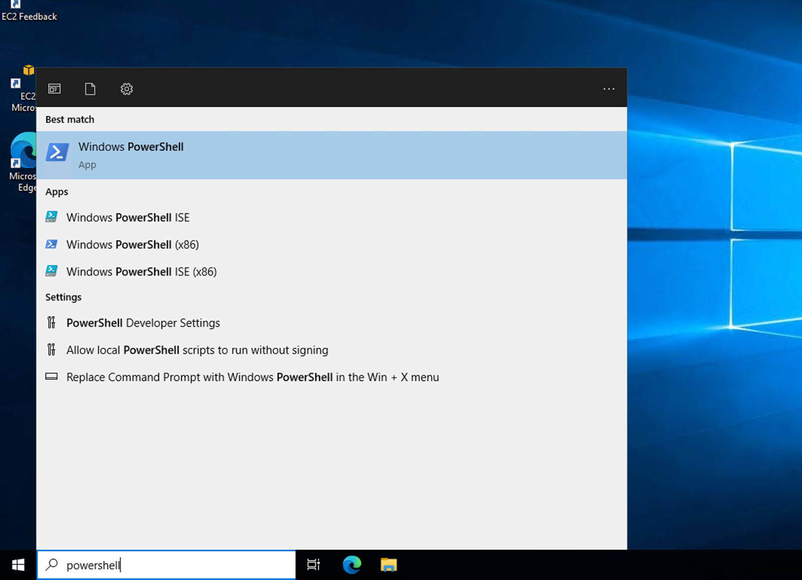
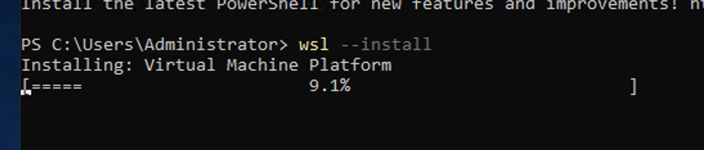
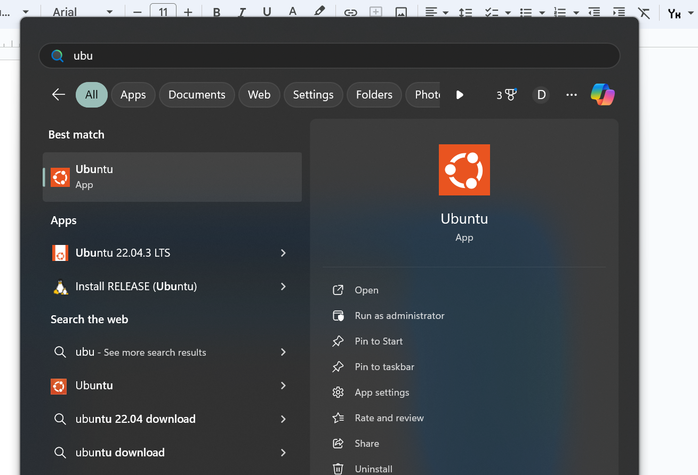
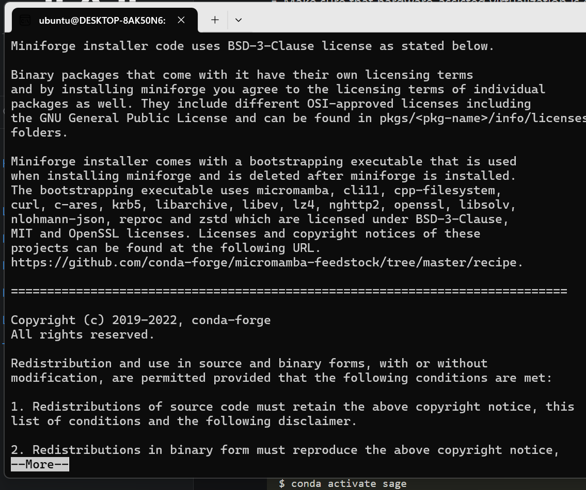
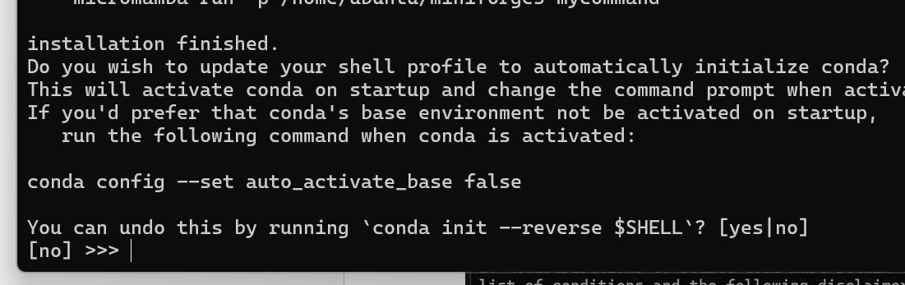
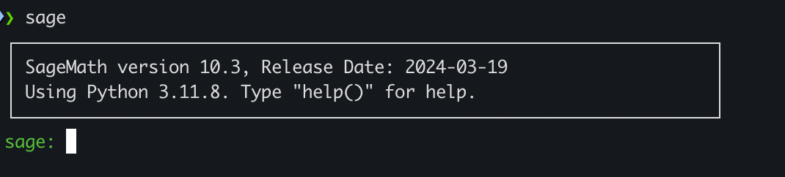

# sage-labs2024

Тут будуть розміщуватись всі необхідні матеріали для лабораторних робіт з теорії груп.

Завдання необхідно виконувати в математичному пакеті [Sagemath](https://www.sagemath.org/). Є кілька
онлайн інтерпретаторів, які можна для цього використати, зокрема:

- https://sagecell.sagemath.org/
- https://cocalc.com/

Для продвинутих пропонується встановити sage локально.

## Встановлення Sagemath на локальну машину

Деталі можна знайти на [сайті](https://doc.sagemath.org/html/en/installation/).

### Windows

Нативного пакету під віндовс нема, тому для робіт вам доведеться використовувати WSL -- Windows Subsytem Linux. Це
типу повноцінне ядро лінукса, яке запускається на вашій системі. З приходом WSL2 це реальне опен-сорсне ядра, а не
копія майкрософта. Встановити його дуже просто:

- відкриваємо PowerShell від адміністратора (пуск -> пошук по назві)



- пишемо `wsl --install`



- перезапускаємо компʼютер
- після перезапуску в пуску можна буде знайти Ubuntu по назві:



- після запуску вона запропонує вам створити користувача і придумати для цього пароль. Можете не вигадувати щось складне, головне -- запамʼятайте.

- тепер у вас на машині повноцінний лінукс і встановлення на нього нічим не відрізняється від звичайної убунти

### Ubuntu / Macos

Для Ubuntu 22.04 і нижче sagemath існував як окремий системний пакет, що було доволі приємно. Однак, розробники вирішили, що це занадто складно підтримувати, тому в найновішій Ubuntu 24.04 встановлення можливе тільки через
conda-forge. Тому якщо у вас стара убунта, можете просто запустити:

```bash
sudo apt-get install sagemath
```

Для всіх інших (включно з тими, хто встановлював WSL) доведеться поставити анаконду. Якщо ви знаєте що це таке, то можете ставити як вам заманеться. На сторінці sagemath рекомендують отак:

```bash
curl -L -O "https://github.com/conda-forge/miniforge/releases/latest/download/Miniforge3-$(uname)-$(uname -m).sh"
bash Miniforge3-$(uname)-$(uname -m).sh
```


При встановленні вам доведеться ʼпрочитатиʼ ліцензію в термінальному редакторі. Щоб вийти з нього треба натиснути англійську `q`:



Далі введіть всюди `yes`, або `enter`, особливо в останньому питанні:




Після цього перезапустіть термінал.

Тепер у вас є __conda__ -- менеджер віртуальних середовищ для пайтона і не тільки. Раніше ми створювали віртуальні середовища за допомогою команди

```bash
python -m venv venv
```

Ця команда створювала папку `venv/` в робочій директорії, де знаходиться повна копія інтерпретатора Python з усіма необхідними вам пакетами. Щоб його запустити треба було використати команду

```bash
source venv/bin/activate
```

 Мінус цього підходу -- якщо багато проектів, то треба створювати багато віртуальних середовищ, а всі вони займають місце.

Anaconda вирішує цю проблему (і створює купу інших). Вона дозволяє вам створити віртуальне середовище, яке буде доступне з будь-якого місця на компʼютері, тому схожі проекти можуть використовувати одне й те саме середовище.

У нашому ж випадку анаконда може створити окреме середовище для Sage (пакет доволі великий, тож треба вільне місце і стабільний інтернет):

```python
conda create -n sage sage python=3.11
```

Тепер у вас є глобальне віртуальне середовище спеціально для сейджа. Щоб активувати його:

```
conda activate sage
```

Тепер можна запустити sage як звичайний інтерпретатор:

```
sage
```



А ще краще -- запустити сейдж в уже знайомому jupyter notebook:

```bash 
sage -n jupyter
```